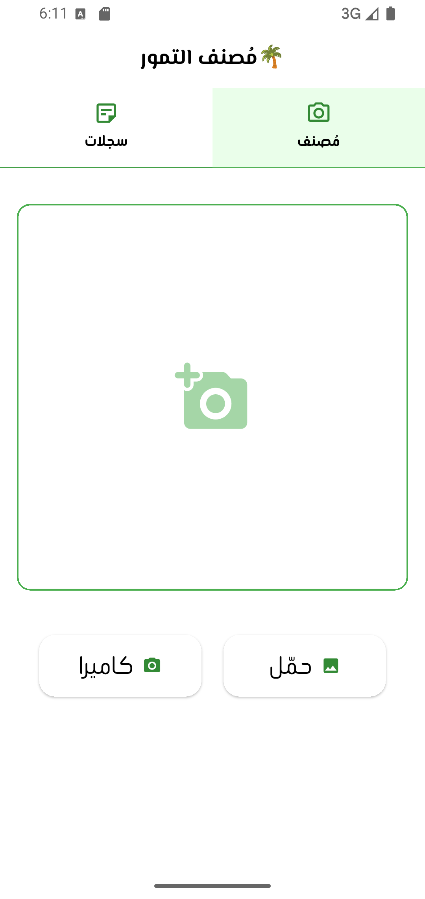
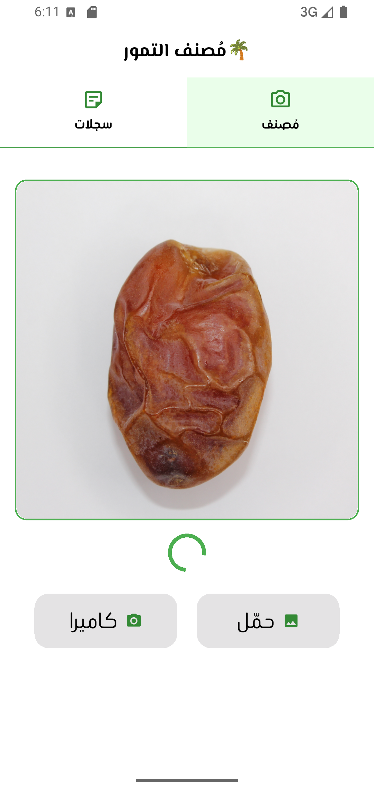
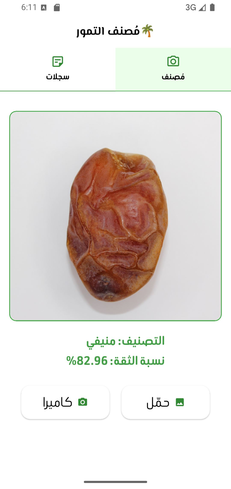
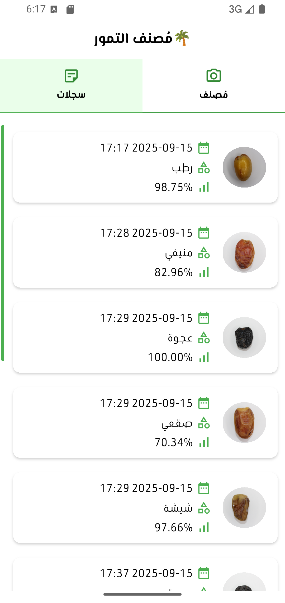

# 🌴 Dates Classifier App (dates_classifier)

A Flutter application that classifies different types of dates using AI, showing confidence scores, and stores the results locally for easy reference.

## ✨ Features

📸 Capture or Pick Images: Upload a date image from the camera or gallery.

🤖 AI-based Classification: Automatically detects the type of date and shows confidence score.

💾 Local Storage: Save classification results with image and timestamp in a local database.

📜 History List: Browse all past attempts with the ability to delete individual entries.

🟢 Modern Design: Green theme colors and Arabic-friendly fonts (Google Fonts Beiruti).

✅ Custom Scrollbar: Green-colored scrollbar on the right with spacing from the list items.

## 🖼️ Screenshots & UI

Main Classifier Screen:
Shows the selected image in a container with a green border and options to pick from gallery or camera.

Classification Result:
Displays the date type in Arabic with confidence percentage, and a loading indicator while processing.

History Screen:
A list of previous attempts with a swipe-to-delete feature and a green scrollbar on the right.

## UI Highlights:

Smooth rounded containers for images.

Buttons for camera and gallery clearly displayed.

Arabic-friendly text for results and history.

Loading indicator appears only while awaiting the AI result.

## 🛠️ Technologies Used

Flutter 🐦

Dart

SQLite (sqflite) for local database storage

image_picker 📸 for image selection

intl for date formatting

google_fonts for Arabic-friendly fonts

## Screenshots

### Splash Screen

### Main Classifier Screen
<<table>
<tr>
  <td style="padding-right:20px;"></td>
  <td></td>
</tr>
</table>

### Classification Result

### History Screen

## 🔹 Use Cases

Helpful for farmers, researchers, and consumers to quickly identify types of dates.

Supports agricultural innovation in regions where date palms are widely cultivated.

## Getting Started

This project is a starting point for a Flutter application.

A few resources to get you started if this is your first Flutter project:

- [Lab: Write your first Flutter app](https://docs.flutter.dev/get-started/codelab)
- [Cookbook: Useful Flutter samples](https://docs.flutter.dev/cookbook)

For help getting started with Flutter development, view the
[online documentation](https://docs.flutter.dev/), which offers tutorials,
samples, guidance on mobile development, and a full API reference.
